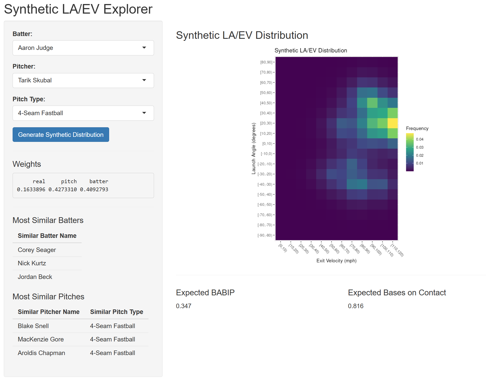

Major League Baseball's Statcast system uses high-speed cameras and Doppler radon to track every pitch and batted ball. It provides detailed measurements such as pitch velocity, spin rate, movement, and location data, as well as batted-ball metrics like exit velocity, launch angle, distance, and play outcomes. This rich, pitch-by-pitch dataset enables deep analysis of player tendencies, pitch characteristics, and offensive performance.

This project has two main goals:

**1. Understanding Pitch and Batter Performance Structures**
I explore the structure of pitch characteristics and batter performance being dimensionality-reduction and clustering techniques. t-SNE and PCA are used to visualize similarities among pitches and identify major axes of variation. Gaussian mixture models then cluster pitches based on their physical properties, allowing comparison between data-driven clusters and Statcast pitch labels. A parallel workflow examines batters' performance profiles across pitch types. The project includes interactive visualizations linking pitches and performance metrics.

**2. Predicting Batter-Pitcher Outcomes Under Data Sparsity**
Individual batter-pitcher matchups are often too sparse to support reliable prediction. To address this, I adapt ideas from the Synthetic Estimated Average Matchup (SEAM) framework to augment sparse matchups with data from similar pitchers and similar batters. By borrowing observations from players with comparable pitch characteristics or batting performance profiles, the application estimates the expected distribution of exit velocity and launch angle for a given matchup, along with derived metrics such as expected batting average on balls in play and expected total bases.

To explore this project, clone this Github repository to your local machine. Navigate to the project folder in a terminal emulator and run `bash start.sh` to initialize the reproducible analysis environment built using Docker. Open `localhost:8787` in your browser and enter the username and password displayed by the start script. Running `make` in the RStudio Server terminal will then automate the analysis and build the project report, Shiny app, and interactive visualizations.

**Important note:** Please note that the web server that is queried in the first step of the analysis can sometimes be unreliable and return the error "No payload acquired" in the middle of pulling the data. I have been unable to figure out why this happens, but trying again and re-running the pull_data.R script will usually resolve the issue. The task of pulling the data usually takes approximately 30-40 minutes.

Instructions for developers: The project is organized using the build system Make, which allows for the project workflow to be automated. The Makefile describes all of the dependencies between the elements of the project and can be used to easily update downstream elements if an earlier component is modified. The project is also developed using Docker, to create an identical environment for the analysis, preconfigured with all required packages.